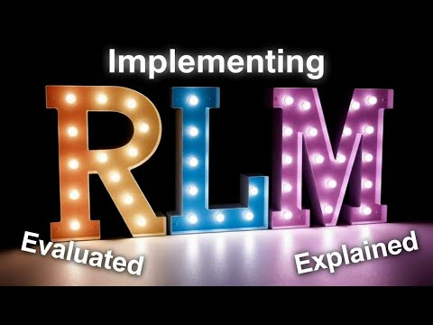
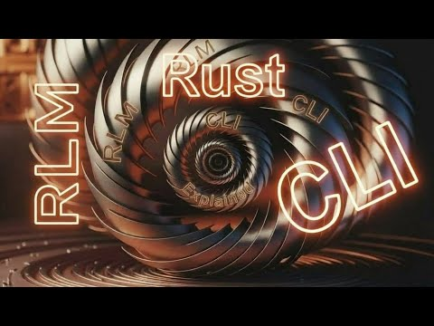
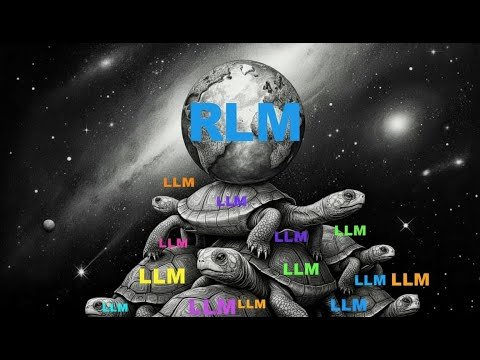

# RLM - Recursive Language Models

A practical implementation of Recursive Language Models based on the paper ["Recursive Language Models"](https://arxiv.org/html/2512.24601v1) by Zhang, Kraska, and Khattab (MIT CSAIL).

## Video Series

Watch the full [RLM Implementations Playlist](https://www.youtube.com/playlist?list=PLKjvVAEaR4itAgRBOJGi-B2CCY2-Wvgem) on YouTube:

| | | |
|:---:|:---:|:---:|
| [](https://www.youtube.com/watch?v=5DhaTPuyhys) | [](https://www.youtube.com/watch?v=d5gaL4iOdLA) | [](https://www.youtube.com/watch?v=jMo5AaMRUkM) |
| **RLM Explained** | **War and Peace Demo** | **WASM Sandboxing** |
| [](https://www.youtube.com/watch?v=oN6XyZdEHqY) | [](https://www.youtube.com/watch?v=a-p4kojgJtM) | [](https://www.youtube.com/watch?v=l6OjvtG2Nlk) |
| **Native CLI Binaries** | **Detective Mystery Demo** | **Large Context Processing** |

## What is RLM?

RLM is an inference strategy that allows LLMs to process **arbitrarily long contexts** by:

1. Having the LLM output structured commands to examine context
2. Executing those commands and returning results
3. Iterating until the LLM reaches a final answer
4. Using sub-LM calls for semantic analysis of chunks

This handles inputs **2 orders of magnitude beyond model context windows**.

> **New to RLM?** Start with [docs/beginners/](docs/beginners/) for gentle introductions.

## Project Status

| Component | Status | Description |
|-----------|--------|-------------|
| **Rust Orchestrator** | ✅ Production | Pure Rust, structured JSON commands, WASM support |
| **WASM Execution** | ✅ Working | Sandboxed dynamic code via wasmtime |
| **Visualizer** | ✅ Working | Interactive HTML at `/visualize` |
| **Multi-Provider** | ✅ Working | DeepSeek, Ollama (local/remote) |
| **Python PoC** | 📦 Legacy | Original proof-of-concept (see below) |

## Implementation Evolution

This project evolved through several phases:

1. **Python PoC** (`src/rlm.py`) - Initial proof-of-concept using Python's `exec()` for arbitrary code execution. Validated the RLM concept but had security concerns.

2. **Rust + Structured Commands** - Replaced Python with pure Rust. LLM outputs JSON commands (`slice`, `find`, `regex`, etc.) instead of arbitrary code. Safer but less flexible.

3. **Rust + WASM** (current) - Added WebAssembly support via wasmtime. LLM can now generate dynamic analysis code that runs in a sandboxed WASM environment. Best of both worlds: flexibility + safety.

## Quick Start

```bash
cd rlm-orchestrator

# Configure providers in config.toml
# Set API key if using DeepSeek
export DEEPSEEK_API_KEY="your-key"

# Run the server
cargo run --bin rlm-server

# Open visualizer
open http://localhost:8080/visualize

# Or use the API
curl -X POST http://localhost:8080/query \
  -H "Content-Type: application/json" \
  -d '{"query": "How many errors?", "context": "Line 1: OK\nLine 2: ERROR\nLine 3: OK"}'
```

### Legacy Python CLI

The original Python implementation is preserved at `src/rlm.py` for reference. It uses a different approach (Python code execution) and is not recommended for production use.

```bash
# For historical reference only
pip install httpx rich typer pydantic
python src/rlm.py --query "..." --context-file ./file.txt
```

## Documentation

> **[View the Wiki](https://github.com/softwarewrighter/rlm-project/wiki)** for comprehensive documentation with architecture diagrams, usage examples, and API reference.

### For Beginners
- [docs/beginners/what-is-rlm.md](docs/beginners/what-is-rlm.md) - What RLM is and why it matters
- [docs/beginners/how-it-works.md](docs/beginners/how-it-works.md) - Step-by-step walkthrough
- [docs/beginners/getting-started.md](docs/beginners/getting-started.md) - Your first RLM query

### Technical Documentation
- [docs/architecture.md](docs/architecture.md) - Rust orchestrator design
- [docs/commands.md](docs/commands.md) - Available JSON commands
- [docs/visualizer.md](docs/visualizer.md) - Using the web visualizer
- [docs/optimizing.md](docs/optimizing.md) - Performance optimization

### Reference
- [docs/api.md](docs/api.md) - REST API reference
- [docs/config.md](docs/config.md) - Configuration options

## Architecture

```
┌─────────────┐     ┌─────────────────┐     ┌─────────────┐
│   Client    │────▶│  RLM Server     │────▶│  Root LLM   │
│  /visualize │     │  (Rust/Axum)    │     │  (DeepSeek) │
└─────────────┘     └────────┬────────┘     └─────────────┘
                             │
                    ┌────────▼────────┐
                    │ Command Executor │
                    │  slice, find,   │
                    │  regex, count,  │
                    │  llm_query...   │
                    └────────┬────────┘
                             │
              ┌──────────────┼──────────────┐
              ▼              ▼              ▼
        ┌──────────┐  ┌──────────┐  ┌──────────┐
        │ Ollama   │  │ Ollama   │  │ Ollama   │
        │ (local)  │  │ (big72)  │  │ (other)  │
        └──────────┘  └──────────┘  └──────────┘
              Sub-LM Pool (for llm_query)
```

## Available Commands

The LLM outputs JSON commands that the executor runs:

| Command | Description | Example |
|---------|-------------|---------|
| `slice` | Get character range | `{"op": "slice", "start": 0, "end": 1000}` |
| `lines` | Get line range | `{"op": "lines", "start": 0, "end": 50}` |
| `find` | Find text occurrences | `{"op": "find", "text": "ERROR"}` |
| `regex` | Regex search | `{"op": "regex", "pattern": "def \\w+"}` |
| `count` | Count lines/chars/matches | `{"op": "count", "what": "matches"}` |
| `llm_query` | Sub-LM semantic call | `{"op": "llm_query", "prompt": "Summarize: ${chunk}"}` |
| `final` | Return answer | `{"op": "final", "answer": "Found 3 errors"}` |

## API Endpoints

| Endpoint | Method | Description |
|----------|--------|-------------|
| `/health` | GET | Health check |
| `/query` | POST | Simple query → answer |
| `/debug` | POST | Full iteration history |
| `/visualize` | GET | Interactive HTML visualizer |

## Configuration

Edit `rlm-orchestrator/config.toml`:

```toml
max_iterations = 20
max_sub_calls = 50

# Root LLM (smart, for orchestration)
[[providers]]
provider_type = "deepseek"  # or "ollama"
model = "deepseek-chat"
role = "root"

# Sub LLM (fast, for llm_query)
[[providers]]
provider_type = "ollama"
base_url = "http://localhost:11434"
model = "qwen2.5-coder:14b"
role = "sub"
```

### Using LiteLLM Gateway

For unified LLM access via [LiteLLM](https://github.com/BerriAI/litellm), use `config-litellm-cli.toml`:

**1. Set up environment variables in `~/.env`:**
```bash
LITELLM_MASTER_KEY=sk-your-key-here
LITELLM_HOST=http://localhost:4000
```

**2. Load env vars and start the server:**
```bash
cd rlm-orchestrator
export $(cat ~/.env | grep -v '^#' | xargs) && ./target/release/rlm-server config-litellm-cli.toml
```

**Important:** Always use the `export $(cat ~/.env | grep -v '^#' | xargs)` pattern to load environment variables. `source ~/.env` does not work reliably in all contexts.

### Running L3 CLI Demos

Level 3 demos use native Rust binary execution and require LiteLLM:

```bash
# Load env vars and run demo
export $(cat ~/.env | grep -v '^#' | xargs) && ./demo/l3/percentiles.sh
export $(cat ~/.env | grep -v '^#' | xargs) && ./demo/l3/error-ranking.sh
export $(cat ~/.env | grep -v '^#' | xargs) && ./demo/l3/unique-ips.sh
```

## Roadmap

| Feature | Status | Description |
|---------|--------|-------------|
| Parallel sub-LM execution | 🔜 Planned | Run multiple `llm_query` calls concurrently across GPU backends |
| More WASM modules | 🔜 Planned | Pre-compiled modules for JSON, CSV, code analysis |
| LLM-generated WAT | 🔬 Research | Have LLM generate WebAssembly Text format directly |
| Streaming responses | 💭 Considered | Stream partial results during long analysis |

See [docs/wasm-design.md](docs/wasm-design.md) for technical roadmap details.

## License

MIT License

## References

- [Recursive Language Models Paper](https://arxiv.org/html/2512.24601v1)
- [Ollama](https://ollama.ai)
- [DeepSeek API](https://platform.deepseek.com)
